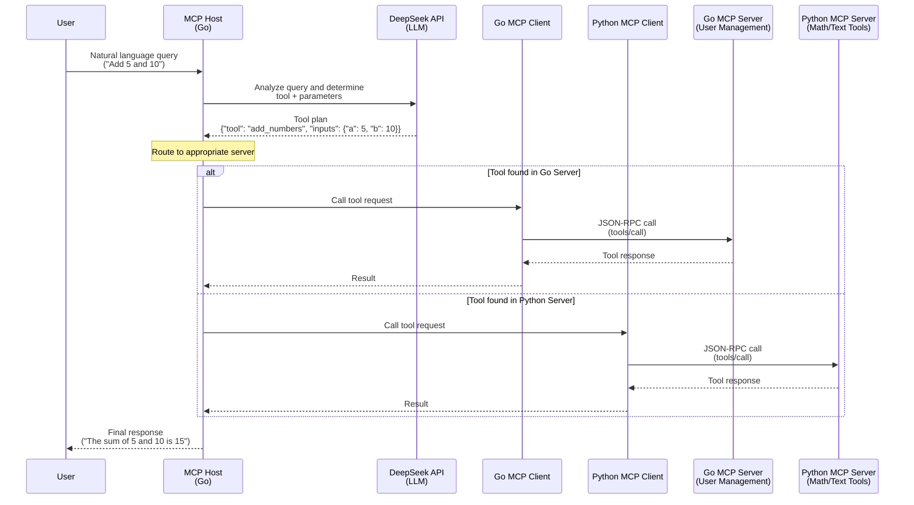

# MCP Example with Go

This project demonstrates the Model Context Protocol (MCP) implementation using Go for the host application and both Go and Python for the MCP servers. The example showcases how different MCP servers can provide specialized tools that can be orchestrated by an LLM-powered host application.

## Architecture Overview

The project consists of three main components:

1. **MCP Host (Go)** - An intelligent host application that integrates with an LLM (DeepSeek API) to analyze user queries and call appropriate tools from the MCP servers
2. **MCP Server Go** - Provides user management tools
3. **MCP Server Python** - Provides mathematical and text processing tools

### System Interaction Flow



## Workflow example


## LLM Integration with DeepSeek

This project uses **DeepSeek API** as the Large Language Model (LLM) to provide intelligent tool orchestration capabilities. DeepSeek serves as the "brain" of the system, analyzing natural language queries and determining the appropriate tools to call.

### DeepSeek's Role

1. **Natural Language Understanding**: DeepSeek analyzes user queries written in plain English to understand the intent and extract relevant parameters

2. **Tool Selection**: Based on the available tool schemas from both MCP servers, DeepSeek determines which specific tool should be called to fulfill the user's request

3. **Parameter Extraction**: The LLM extracts and formats the necessary parameters from the user query into the correct data types and structure required by the target tool

4. **Response Planning**: DeepSeek generates a structured JSON response containing:
   - The tool name to be called
   - The input parameters with proper types and values
   - Any validation or preprocessing needed

### Example LLM Processing

For a user query like **"Add 5 and 10"**, DeepSeek:

1. **Understands** that this is a mathematical operation
2. **Identifies** that the `add_numbers` tool from the Python server should be used
3. **Extracts** the numbers `5` and `10` as the `a` and `b` parameters
4. **Returns** a structured plan: `{"tool": "add_numbers", "inputs": {"a": 5, "b": 10}}`

### Configuration

The DeepSeek integration requires an API key that must be set as an environment variable:

```bash
export DEEPSEEK_API_KEY="your-deepseek-api-key"
```

> **Security Note:**
>
> - Keep your API key secure and do not commit it to version control systems (e.g., Git).
> - Use environment variable managers or secret management tools to store API keys securely.
> - Restrict the permissions of your API key to the minimum necessary for your application.

The host application communicates with DeepSeek via HTTPS API calls to analyze queries and receive tool execution plans, making the system capable of handling complex, multi-step reasoning tasks through natural language interfaces.

## MCP Server Tools

### Go MCP Server (Port 8090)

The Go server provides user management functionality with the following tools:

- **`get_user`** - Retrieve user information by user ID

  - Input: `user_id` (string, required)
  - Returns: User details including name, email, and age

- **`create_user`** - Create a new user in the system
  - Input:
    - `user_id` (string, required)
    - `name` (string, required)
    - `email` (string, required)
    - `age` (number, optional, minimum: 0)
  - Returns: Confirmation of user creation

The server comes pre-populated with sample users (Alice, Bob, Charlie) and uses in-memory storage.

### Python MCP Server (Port 9000)

The Python server provides mathematical and text processing tools:

- **`add_numbers`** - Add two numbers together

  - Input: `a` (float), `b` (float)
  - Returns: Sum of the two numbers

- **`multiply_numbers`** - Multiply two numbers together

  - Input: `a` (float), `b` (float)
  - Returns: Product of the two numbers

- **`process_text`** - Process text with various operations
  - Input:
    - `text` (string)
    - `operation` (string) - Available: "upper", "lower", "reverse"
  - Returns: Processed text based on the operation

## What the Demo Does

The demo application showcases an intelligent tool orchestration system where:

1. **User Query Processing**: The host receives natural language queries from users
2. **LLM Analysis**: The DeepSeek API analyzes the query to determine which tool to call and with what parameters
3. **Tool Selection**: The host automatically routes the request to the appropriate MCP server (Go or Python)
4. **Tool Execution**: The selected tool is executed with the LLM-determined parameters
5. **Response**: Results are returned to the user

### Example Interactions

The demo runs three example queries:

1. **"Read user with Id 2"** → Calls `get_user` tool on the Go server
2. **"Create a new user with Id [timestamp], name 'John Doe', email 'jhondoe at example.com', age 30"** → Calls `create_user` tool on the Go server
3. **"Add two numbers 5 and 10"** → Calls `add_numbers` tool on the Python server

## Interactive UI with Bubble Tea

The MCP host application features a modern terminal user interface built with the [Bubble Tea](https://github.com/charmbracelet/bubbletea) library, providing an interactive way to communicate with MCP servers.

### UI Features

- **💬 Interactive Query Input**: Type natural language queries and get real-time responses
- **📋 OpenAPI Specification Viewer**: Browse MCP server documentation directly in the terminal
- **⚡ Real-time Processing**: See spinner animations while queries are being processed
- **🎨 Syntax Highlighting**: Color-coded responses and error messages
- **⌨️ Keyboard Shortcuts**: Efficient navigation with hotkeys

### How to Use the UI

#### **Basic Interaction**

1. **Enter Queries**: Type your natural language request in the input field

   ```text
   Enter your query:
   > Add 15 and 25
   ```

2. **Submit**: Press `Enter` to send your query to the MCP servers

3. **View Results**: The LLM will analyze your request, select the appropriate tool, and display the response

#### **Keyboard Shortcuts**

| Key Combination | Action                                         |
| --------------- | ---------------------------------------------- |
| `Enter`         | Submit query to MCP servers                    |
| `Ctrl+O`        | Toggle Go MCP Server OpenAPI specification     |
| `Ctrl+Y`        | Toggle Python MCP Server OpenAPI specification |
| `Ctrl+R`        | Reset/clear current query and response         |
| `Q` or `Ctrl+C` | Quit application                               |

#### **OpenAPI Specification Viewer**

The UI includes built-in viewers for both MCP servers' OpenAPI specifications:

- **Go Server Spec** (`Ctrl+O`): View user management tools documentation
- **Python Server Spec** (`Ctrl+Y`): View math and text processing tools documentation

Navigate through the specifications using:

- `↑/↓` or `j/k`: Scroll up/down
- `Page Up/Page Down`: Fast scroll
- `Home/End`: Jump to beginning/end

#### **Example Usage Session**

```bash
# In the UI:
> Create a user with name Alice and email alice@example.com
→ Response: User created successfully with ID 1234567890

> Add 42 and 58
→ Response: The sum of 42 and 58 is 100

> Convert "hello world" to uppercase
→ Response: Uppercase: HELLO WORLD

# Press Ctrl+O to view Go server documentation
# Press Ctrl+Y to view Python server documentation
# Press Q to quit
```

### UI vs Command Line Mode

The application automatically detects the environment:

- **TTY Available**: Runs the interactive Bubble Tea UI
- **No TTY** (debugging/CI): Falls back to command-line examples mode

This ensures the application works in both development and production environments.

## Running the Demo

### Prerequisites

- Docker and Docker Compose
- DeepSeek API key

### Quick Start

1. Set your DeepSeek API key:

   ```bash
   export DEEPSEEK_API_KEY="your-api-key-here"
   ```

2. Run the demo:

   ```bash
   make run-demo
   ```

   Or manually with Docker Compose:

   ```bash
   DEEPSEEK_API_KEY="your-api-key" make run-demo
   ```

### Manual Testing

You can also test the MCP servers directly using curl:

#### Get tools list from Go MCP server

- Start the Go MCP server if it's not started yet

```bash
  cd mcp-server-go && make run
```

- Ask for available tools

```bash
curl --request POST \
  --url http://localhost:8090/mcp \
  --header 'Accept: application/json, text/event-stream' \
  --header 'Content-Type: application/json' \
  --data '{
  "jsonrpc": "2.0",
  "id": 2,
  "method": "tools/list",
  "params": {}
}'
```

#### Test user creation

- Start the Go MCP server if it's not started yet

```bash
  cd mcp-server-go && make run
```

- Create the new user

```bash
curl --request POST \
  --url http://localhost:8090/mcp \
  --header 'Accept: application/json, text/event-stream' \
  --header 'Content-Type: application/json' \
  --data '{
  "jsonrpc": "2.0",
  "id": 3,
  "method": "tools/call",
  "params": {
    "name": "create_user",
    "arguments": {
      "user_id": "test123",
      "name": "Test User",
      "email": "test@example.com",
      "age": 25
    }
  }
}'
```

## Project Structure

```text
mcp-example/
├── docs/                        # Documentation and assets
│   └── example.gif.             # Demo video showing UI interaction
├── mcp-host/                    # Go-based MCP host application
│   ├── Dockerfile               # Container build instructions
│   ├── Makefile                 # Build and run tasks
│   ├── go.mod                   # Go module dependencies
│   ├── cmd/main.go              # Main application entry point (with TTY detection)
│   ├── pkg/mcphost/             # Host implementation and LLM integration
│   │   ├── host.go              # Core MCP host logic
│   │   ├── llm-client.go        # DeepSeek API integration
│   │   ├── mcp-client-go.go     # Go MCP server client
│   │   └── mcp-client-python.go # Python MCP server client
│   └── script/run.sh            # Interactive startup script
├── mcp-server-go/               # Go MCP server for user management
│   ├── Dockerfile               # Container build instructions
│   ├── Makefile                 # Build and run tasks
│   ├── go.mod                   # Go module dependencies
│   ├── cmd/main.go              # Server entry point
│   ├── internal/mcpserver/      # User management tools implementation
│   │   ├── http.go              # HTTP server and health endpoints
│   │   ├── mcp-server.go        # MCP protocol implementation
│   │   └── openapi.json         # OpenAPI 3.0 specification
│   └── script/run.sh            # Interactive startup script
├── mcp-server-python/           # Python MCP server for math/text tools
│   ├── Dockerfile               # Container build instructions
│   ├── Makefile                 # Build and run tasks
│   ├── mcp-server.py            # FastMCP-based server (with OpenAPI endpoint)
│   ├── requirements.txt         # Python dependencies
│   └── scripts/                 # Python setup and run scripts
│       ├── run.sh               # Interactive startup script
│       └── setup.sh             # Environment setup
├── scripts/                     # Utility scripts
│   └── run-demo.sh              # Main demo execution script
├── docker-compose.yml           # Multi-container orchestration (with TTY support)
├── Makefile                     # Root-level build tasks
├── README.md                    # This comprehensive documentation
├── LICENSE                      # Project license
└── .gitignore                   # Git ignore patterns
```

## Key Features

- **Interactive Terminal UI**: Modern Bubble Tea-based interface with real-time query processing
- **Multi-language MCP ecosystem**: Demonstrates interoperability between Go and Python MCP servers
- **LLM-powered tool orchestration**: Uses AI to intelligently select and call appropriate tools
- **Built-in Documentation Viewer**: Browse OpenAPI specifications directly in the terminal
- **Automatic server routing**: Host application automatically tries both servers to find the right tool
- **Environment Detection**: Automatically switches between UI and CLI mode based on TTY availability
- **Containerized deployment**: Full Docker Compose setup for easy testing and deployment
- **Health checks**: Robust container health monitoring and startup coordination

## What is pending?

- Adding multi steps support. For example: "Add 1 to 4 and multiply the result by 2"
- Adding a Authn/Authz layer between the host and the MCPs
- Improving the UI
